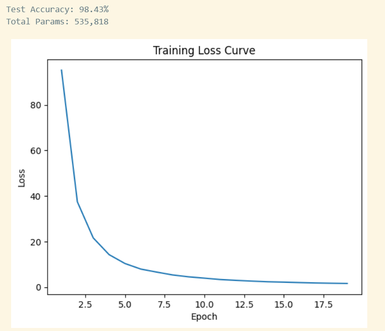
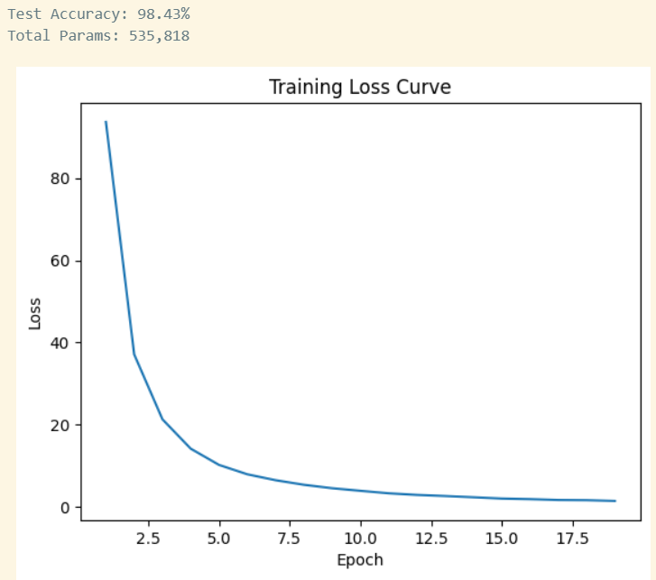
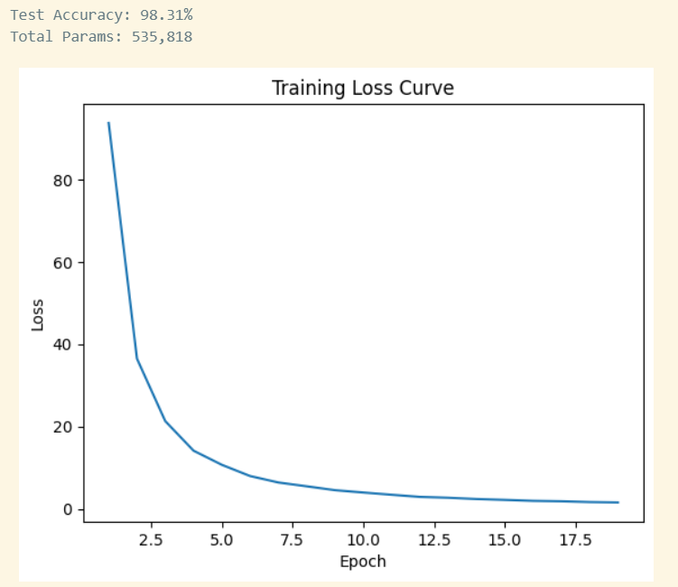
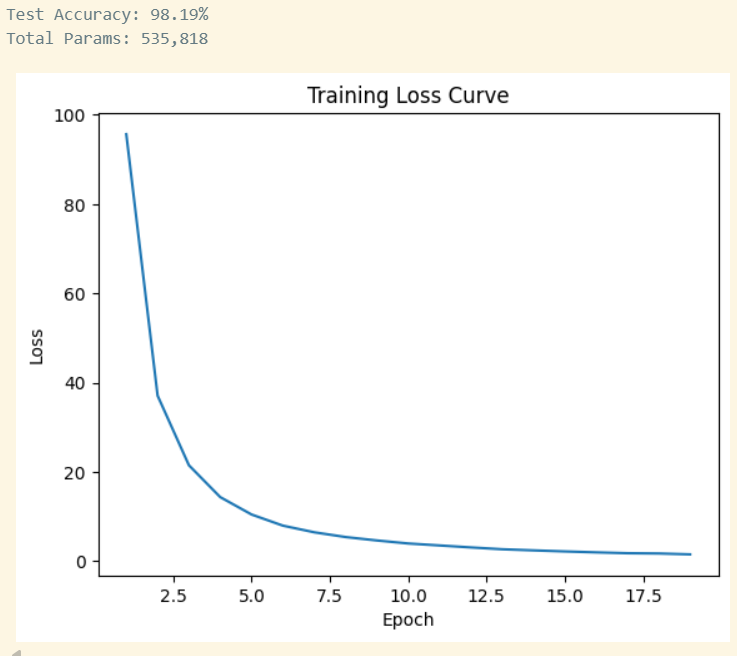

# MNIST 손글씨 인식 과제 보고서

## 0. 반·팀원

| 항목     | 내용            |
| ------ | ------------- |
| **반**  | 301 (SW_AI트랙)    |
| **팀원** | 김석제, 김진호, 박지용, 서원규 |

---

## 1. 실험 목적

MNIST 10-class 분류를 **NumPy만으로 구현한 신경망**으로 수행하고, 테스트 정확도와 학습 과정을 보고합니다.

---

## 2. 모델 구조

| 구분      | 내용                                                               |
| ------- | ---------------------------------------------------------------- |
| **입력**  | 784 (28×28 픽셀, 0~1 정규화)                                          |
| **은닉층** | Affine → BatchNorm → ReLU → Dropout 순으로 구성 (층 수·뉴런 수는 실험에 맞게 기입) |
| **출력**  | Affine(→10) + Softmax                                            |

**예시 (2층 은닉):**  
입력 784 → Affine(512) → BatchNorm → ReLU → Dropout → Affine(256) → BatchNorm → ReLU → Dropout → Affine(10) → Softmax

---

## 3. 학습 설정

초기 설정
| 항목                 | 값           |
| ------------------ | ----------- |
| 옵티마이저              | Adam        |
| 학습률 (lr)           | 0.001       |
| epochs             | 1          |
| batch_size         | 64         |
| Dropout 비율         | 0.5         |
| BatchNorm momentum | 0.9         |
| 가중치 초기화            | He (bias 0) |

epoch, batch_size 변경
| 항목                 | 값           |
| ------------------ | ----------- |
| 옵티마이저              | Adam        |
| 학습률 (lr)           | 0.001       |
| epochs             | 20          |
| batch_size         | 128         |
| Dropout 비율         | 0.5         |
| BatchNorm momentum | 0.9         |
| 가중치 초기화            | He (bias 0) |
---

## 4. 실험 환경

- Python 3.11, NumPy, Matplotlib
- 학습 소요 시간: (예: CPU 기준 약 2~3분)

---

## 5. 결과
epoch = 1, batch_size = 64
| 항목           | 값            |
| ------------ | -------------- |
| **테스트 정확도**  | 98.48%     |
| **총 파라미터 수** | 535,818    |

epoch = 1, batch_size = 128
| 항목           | 값            |
| ------------ | -------------- |
| **테스트 정확도**  | 98.48%     |
| **총 파라미터 수** | 535,818    |

epoch = 20, batch_size = 64
| 항목           | 값            |
| ------------ | -------------- |
| **테스트 정확도**  | 98.31%     |
| **총 파라미터 수** | 535,818    |

epoch = 20, batch_size = 128
| 항목           | 값            |
| ------------ | -------------- |
| **테스트 정확도**  | 98.19%     |
| **총 파라미터 수** | 535,818    |

### 손실 커브

- 학습 곡선: (그래프 이미지를 붙이거나, 예: "Epoch 1 Loss 0.42 → Epoch 20 Loss 0.06 수렴" 같이 수치로 요약)

초기 설정(epoch = 1, batch_size = 64)

변경(epoch = 1, batch_size = 128)

변경(epoch = 20, batch_size = 64)

변경(epoch = 20, batch_size = 128)

---

## 6. 회고

- 손실 수렴 여부, 과적합/과소적합 여부
- 구조·학습률·Dropout 등 변경 시도와 그 결과 (있다면 간단히)

epoch가 증가하니, 대체로 성능이 떨어짐 -> 과적합이 발생하고 있지 않았을까? -> 
(plot을 같이 써서 확인해보는게 좋겠어)

현재는 epoch, batch_size만 바꿔서 시도해보았는데 같은 조건에서 droupout, 가중치 초기화 영향이 어떨지도 비교해보면 좋지 않을까?
